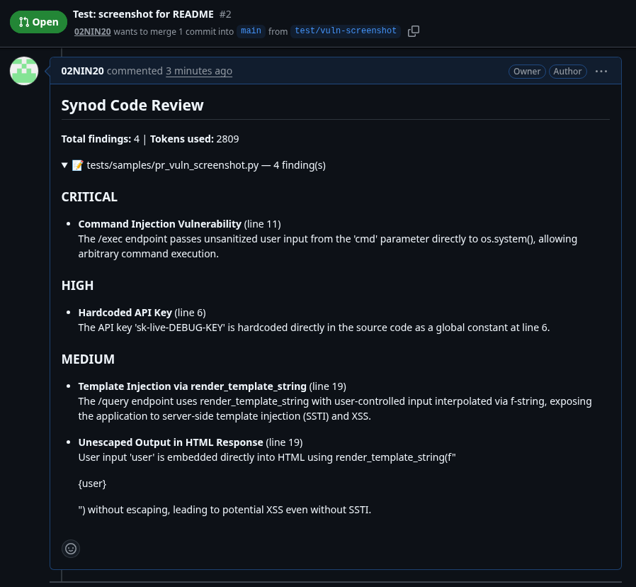

# Synod

Multi-agent code review council, powered by Qwen LLM.  
**Cartographer** maps structure → **Inspector** + **Sentinel** analyze → **Arbiter** deduplicates → **Smith** (optional) generates fixes.

> **Note:** Synod is not an MCP server. It exposes a standard REST API
> (FastAPI). MCP integration is a possible future wrapper, not implemented.

## Architecture

<p align="center">
  
</p>

## How It Works

Synod runs a sequential pipeline of specialized LLM agents. The **Cartographer** first maps the code's structure (modules, dependencies, entry points), then **Inspector** (code quality) and **Sentinel** (security, CWE-mapped) analyze in parallel. **Arbiter** deduplicates and validates findings by consensus. Optionally, **Smith** generates fixes validated by Sentinel in a retry loop.

## Quickstart

```bash
git clone https://github.com/02NIN20/Synod.git
cd Synod
cp .env.example .env
# edit .env — set your DASHSCOPE_API_KEY and review QWEN_MODEL / QWEN_AGENT_MODEL
python3 -m venv .venv && source .venv/bin/activate
pip install -r requirements.txt
```

## Configuration

Environment variables (copy `.env.example` → `.env`):

| Variable | Purpose | Default |
|----------|---------|---------|
| `DASHSCOPE_API_KEY` | DashScope API key (required) | — |
| `QWEN_MODEL` | Main/chat model; also used for direct completions | `qwen3.6-plus-2026-04-02` |
| `QWEN_AGENT_MODEL` | Model for agents that emit strict JSON (`Cartographer`, `Inspector`, `Sentinel`, `Smith`) | `qwen3-coder-next` |
| `GITHUB_TOKEN` | GitHub PAT for posting PR comments | — |
| `GITHUB_WEBHOOK_SECRET` | Shared secret for verifying webhook signatures | — |
| `GITHUB_MAX_FILES_PER_PR` | Skip PRs with more changed files than this | `10` |
| `GITHUB_MAX_FILE_LINES` | Skip individual files larger than this | `500` |

The split is required because several DashScope models handle free-form chat well but fail on the council's JSON agent prompts, returning `None`. The agent model must reliably produce parseable JSON.

**Option A — local development:**
```bash
uvicorn app.main:app --reload
```

**Option B — Docker:**
```bash
docker compose up -d --build
```

**Run a review:**
```bash
./synod review tests/samples/vulnerable_code.py
./synod review tests/samples/vulnerable_code.py --fix   # with fix loop
```

## CLI Usage

| Command | Description |
|---------|-------------|
| `./synod review <file>` | Full multi-agent code review |
| `./synod chat [message]` | Interactive or one-shot chat (code → review, text → LLM reply) |
| `./synod scan <dir>` | Scan a directory, review every file |
| `./synod health` | Check if the API is running |

### Flags

| Flag | Applies to | Description |
|------|------------|-------------|
| `--fix` | review, scan | Enable fix loop (Smith + Sentinel validation) |
| `--show-code` | review | Print the source code before review |
| `--url` | all | API base URL (default: `http://localhost:8000`) |
| `--ext` | scan | File extension filter (default: `.py`) |
| `--limit` | scan | Max files to scan (0 = unlimited) |
| `--yes` | scan | Skip confirmation prompt |

### Chat REPL commands

Inside `./synod chat`:

| Command | Description |
|---------|-------------|
| `/review <file>` | Run a full council review on a file |
| `/scan <dir>` | Scan a directory |
| `/exit` | Quit |

## Benchmark

3 runs per sample per condition, reported as mean ± std.  
**TP**: finding with correct CWE AND line within ±2 lines.  
**FP**: finding with no ground-truth match.  
**FN**: ground-truth bug with no finding.

| Sample | Category | Method | Precision | Recall | F1 | Tokens | Time(s) | Semgrep | LLM |
|--------|----------|--------|-----------|--------|----|--------|---------|---------|-----|
| vulnerable_code.py | security | LLM-only | 1.000±0.000 | 0.583±0.118 | 0.730±0.090 | 47663 | 31.1 | 0.0 | 8.7 |
| vulnerable_code.py | security | Semgrep+LLM | 1.000±0.000 | **0.917±0.118** | **0.952±0.067** | 48306 | 31.0 | 4.0 | 9.0 |
| xss_app.py | security | LLM-only | 1.000±0.000 | 1.000±0.000 | 1.000±0.000 | 60455 | 34.0 | 4.0 | 7.3 |
| xss_app.py | security | Semgrep+LLM | 0.667±0.236 | 1.000±0.000 | 0.778±0.157 | 60952 | 30.2 | 4.0 | 6.7 |
| insecure_deserialize.py | security | LLM-only | 1.000±0.000 | 1.000±0.000 | 1.000±0.000 | 20284 | 26.3 | 3.0 | 4.3 |
| insecure_deserialize.py | security | Semgrep+LLM | 1.000±0.000 | 1.000±0.000 | 1.000±0.000 | 20482 | 29.7 | 3.0 | 5.3 |
| csrf_missing.py | security | LLM-only | 1.000±0.000 | 0.333±0.471 | 0.333±0.471 | 12590 | 27.4 | 1.0 | 3.3 |
| csrf_missing.py | security | Semgrep+LLM | 1.000±0.000 | 0.333±0.471 | 0.333±0.471 | 12862 | 28.7 | 1.0 | 3.3 |
| path_traversal.py | security | LLM-only | 1.000±0.000 | 1.000±0.000 | 1.000±0.000 | 27379 | 29.3 | 1.0 | 3.0 |
| path_traversal.py | security | Semgrep+LLM | 1.000±0.000 | 1.000±0.000 | 1.000±0.000 | 27800 | 33.8 | 1.0 | 3.3 |
| **Avg (security)** | | LLM-only | **1.000** | 0.783 | 0.813 | 33674 | 29.6 | | |
| **Avg (security)** | | Semgrep+LLM | 0.933 | **0.850** | **0.813** | 34080 | 30.7 | | |
| quality_sample.py | quality | LLM-only | 1.000±0.000 | 1.000±0.000 | 1.000±0.000 | 36762 | 25.5 | 0.0 | 6.0 |
| quality_sample.py | quality | Semgrep+LLM | 1.000±0.000 | 1.000±0.000 | 1.000±0.000 | 37482 | 26.2 | 0.0 | 6.0 |
| coupling_sample.py | quality | LLM-only | 1.000±0.000 | 1.000±0.000 | 1.000±0.000 | 5480 | 29.2 | 0.0 | 6.7 |
| coupling_sample.py | quality | Semgrep+LLM | 1.000±0.000 | 1.000±0.000 | 1.000±0.000 | 5642 | 28.0 | 0.0 | 6.3 |
| **Avg (quality)** | | LLM-only | **1.000** | **1.000** | **1.000** | 21121 | 27.4 | | |
| **Avg (quality)** | | Semgrep+LLM | **1.000** | **1.000** | **1.000** | 21562 | 27.1 | | |

**Key findings (old model `qwen3-coder-plus-2025-07-22`):**
- **CWE-22 (path traversal)**: recall already at 1.000 in the LLM-only run; Semgrep+LLM keeps it at 1.000.
- **CWE-352 (CSRF)**: no improvement from semgrep (0.333±0.471 both).
- **CWE-89 / CWE-94 / CWE-798 / CWE-78** (`vulnerable_code.py`): biggest win. Semgrep raised recall from 0.583 to 0.917 and F1 from 0.730 to 0.952.
- **CWE-79 (`xss_app.py`)**: precision dropped to 0.667 in the first Semgrep+LLM run. Fixed by deduping semgrep hits by CWE+line cluster, removing direct semgrep injection, and routing all candidates through Sentinel validation. See re-verification below.
- **Quality samples**: semgrep introduces no false positives.
- **Cost/latency**: token usage essentially unchanged; wall time increases by ~1s per sample for the semgrep scan.

**Conclusion:** the Semgrep pre-filter is worth the added complexity for multi-bug files (`vulnerable_code.py` recall +57%) and provides a deterministic safety net for path traversal and command injection. It does not help CSRF, which remains a known weakness.

> **Model compatibility note:** `qwen3-coder-plus-2025-07-22` produced all numbers above, but its free quota was exhausted. `qwen3.7-max-*` and `qwen3.6-plus-2026-04-02` cannot run the JSON agents alone (Inspector/Sentinel return `None`). The current setup uses a **main/chat model** plus a **dedicated JSON-agent model** via `QWEN_AGENT_MODEL` (see Configuration), so non-JSON models can still drive the council.

### `xss_app.py` re-verification (new model split)

After splitting the model configuration, `xss_app.py` was re-benchmarked with:
- `QWEN_MODEL=qwen3.6-plus-2026-04-02`
- `QWEN_AGENT_MODEL=qwen3-coder-next`
- 3 runs per condition, sample `tests/samples/xss_app.py`

| Method | Precision | Recall | F1 | Tokens/run | Time/run |
|--------|-----------|--------|----|-----------|---------|
| LLM-only | 1.000±0.000 | 0.667±0.471 | 0.667±0.471 | 5,250 | 11.4s |
| Semgrep+LLM | 0.833±0.236 | **1.000±0.000** | **0.889±0.157** | 6,902 | 25.7s |

The Semgrep pre-filter now guarantees 100% recall on this sample, up from 67% with the LLM-only run, while keeping F1 higher (0.889 vs 0.667). One of three runs produced an extra LLM finding at the same CWE, pulling average precision from 1.000 to 0.833. This is improved versus the pre-fix precision of 0.667, but not yet fully restored to 1.000. The remaining false positive is stochastic and tied to Sentinel's LLM pass, not raw semgrep injection.

> **Note:** the old complete table remains above for reference, but those numbers were produced with `qwen3-coder-plus-2025-07-22`. A full re-run of all 7 samples with the new model split is estimated at ~1.18M tokens (above the current `qwen3-coder-next` quota).

## API Reference

| Endpoint | Method | Description |
|----------|--------|-------------|
| `/api/v1/review` | POST | Full council code review |
| `/api/v1/chat` | POST | Chat with intent routing (code → council, text → LLM) |
| `/health` | GET | Health check |

### `/api/v1/review`

```json
{
  "code": "import os\nos.system('ls')",
  "filename": "example.py",
  "enable_fix_loop": false
}
```

### `/api/v1/chat`

```json
{
  "message": "What is a lambda?",
  "history": []
}
```

If `message` looks like code, the endpoint runs the council and returns summarized findings.  
Otherwise, it replies directly via Qwen LLM with conversation `history` for context.

## GitHub Integration

Synod can review pull requests automatically and post findings as a PR comment.

### Setup

1. **Expose the server** to the internet (e.g. via ngrok, Cloudflare Tunnel, or deployed instance).
2. In your GitHub repo, go to **Settings → Webhooks → Add webhook**:
   - **Payload URL**: `https://your-host.example.com/api/v1/webhook/github`
   - **Content type**: `application/json`
   - **Secret**: the same value you set in `GITHUB_WEBHOOK_SECRET`
   - **Events**: select **Pull requests**
3. Set these environment variables:
   ```bash
   GITHUB_TOKEN=ghp_...              # classic or fine-grained token with repo scope
   GITHUB_WEBHOOK_SECRET=...         # must match the secret entered in GitHub
   # optional:
   GITHUB_MAX_FILES_PER_PR=10        # skip PRs larger than this
   GITHUB_MAX_FILE_LINES=500         # skip individual files larger than this
   ```

### What triggers a review

The webhook listens for `pull_request` events with action `opened` or `synchronize`. When triggered:

- Fetches changed files from the PR.
- Skips non-code files, removed files, and files over `GITHUB_MAX_FILE_LINES`.
- Runs the Council on each changed file's patch.
- Aggregates findings into one Markdown comment grouped by severity, with collapsible sections per file.
- Posts the comment via the GitHub Issues API.
- Returns `200` immediately; the review runs as a background task so GitHub's 10s webhook timeout is not exceeded.

### PRs with many changed files

If a PR changes more than `GITHUB_MAX_FILES_PER_PR` files (default 10), Synod posts a comment explaining that the review was skipped to avoid runaway token usage.

### Example PR comment

<p align="center">
  
</p>

> Placeholder: add a real screenshot at `docs/github_pr_comment.png`.

## Tech Stack

| Layer | Technology |
|-------|------------|
| Framework | FastAPI (Python 3.12) |
| LLM | Qwen Cloud — `qwen3.6-plus-2026-04-02` / `qwen3-coder-next` |
| CLI | Typer + Rich + httpx |
| Container | Docker, docker-compose |
| Deployment | ECS |

## Roadmap

- **Semgrep pre-filter** — static analysis pass before LLM agents to reduce cost and ground findings
- **Episodic/semantic memory** — remember past reviews across sessions for context
- **Weighted voting** — Arbiter uses confidence × severity × corroboration for ranking
- ~~**GitHub PR integration** — automatic review comments on pull requests~~ ✅
- **Multi-language** — expand beyond Python (JS/TS, Go, Rust, Java)
- **CI/CD integration** — GitHub Action for automated PR review

## Extensibility

- **New agents**: subclass `BaseAgent`, implement `analyze()`, add to `AgentRole` enum, register in `Council.review()`.
- **New vulnerability classes**: add CWE patterns to Sentinel's `SYSTEM_PROMPT`.
- **LLM backends**: swap `QwenClient` for any OpenAI-compatible provider.
- **Arbiter strategies**: replace or compose dedup/consensus logic.

## License

MIT
