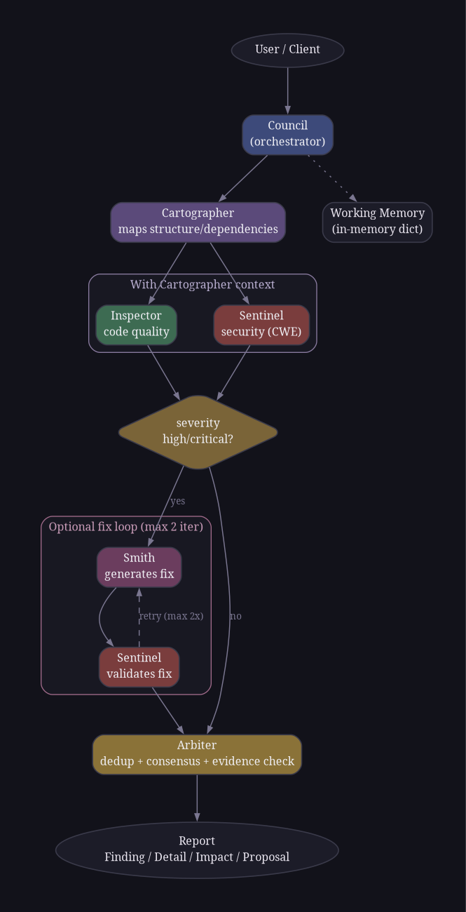

# Synod

Multi-agent code review council, powered by Qwen LLM.  
**Cartographer** maps structure → **Inspector** + **Sentinel** analyze → **Arbiter** deduplicates → **Smith** (optional) generates fixes.

> **Note:** Synod is not an MCP server. It exposes a standard REST API
> (FastAPI). MCP integration is a possible future wrapper, not implemented.

## Architecture

<p align="center">
  
</p>

## How It Works

Synod runs a sequential pipeline of specialized LLM agents. The **Cartographer** first maps the code's structure (modules, dependencies, entry points), then **Inspector** (code quality) and **Sentinel** (security, CWE-mapped) analyze in parallel. **Arbiter** deduplicates and validates findings by consensus. Optionally, **Smith** generates fixes validated by Sentinel in a retry loop.

## Quickstart

```bash
git clone https://github.com/02NIN20/Synod.git
cd Synod
cp .env.example .env
# edit .env — set your DASHSCOPE_API_KEY
python3 -m venv .venv && source .venv/bin/activate
pip install -r requirements.txt
```

**Option A — local development:**
```bash
uvicorn app.main:app --reload
```

**Option B — Docker:**
```bash
docker compose up -d --build
```

**Run a review:**
```bash
./synod review tests/samples/vulnerable_code.py
./synod review tests/samples/vulnerable_code.py --fix   # with fix loop
```

## CLI Usage

| Command | Description |
|---------|-------------|
| `./synod review <file>` | Full multi-agent code review |
| `./synod chat [message]` | Interactive or one-shot chat (code → review, text → LLM reply) |
| `./synod scan <dir>` | Scan a directory, review every file |
| `./synod health` | Check if the API is running |

### Flags

| Flag | Applies to | Description |
|------|------------|-------------|
| `--fix` | review, scan | Enable fix loop (Smith + Sentinel validation) |
| `--show-code` | review | Print the source code before review |
| `--url` | all | API base URL (default: `http://47.84.227.185:8000`) |
| `--ext` | scan | File extension filter (default: `.py`) |
| `--limit` | scan | Max files to scan (0 = unlimited) |
| `--yes` | scan | Skip confirmation prompt |

### Chat REPL commands

Inside `./synod chat`:

| Command | Description |
|---------|-------------|
| `/review <file>` | Run a full council review on a file |
| `/scan <dir>` | Scan a directory |
| `/exit` | Quit |

## Benchmark

3 runs per sample, reported as mean ± std.  
**TP**: finding with correct CWE AND line within ±2 lines.  
**FP**: finding with no ground-truth match.  
**FN**: ground-truth bug with no finding.

| Sample | Category | Precision | Recall | F1 | Tokens | Time(s) |
|--------|----------|-----------|--------|----|--------|---------|
| vulnerable_code.py | security | 1.000±0.000 | 1.000±0.000 | 1.000±0.000 | 38706 | 20.9 |
| xss_app.py | security | 1.000±0.000 | 1.000±0.000 | 1.000±0.000 | 45484 | 15.9 |
| insecure_deserialize.py | security | 1.000±0.000 | 1.000±0.000 | 1.000±0.000 | 15952 | 14.4 |
| csrf_missing.py | security | 1.000±0.000 | 0.667±0.471 | 0.667±0.471 | 10916 | 13.6 |
| path_traversal.py | security | 1.000±0.000 | 0.000±0.000 | 0.000±0.000 | 21518 | 15.6 |
| **Avg (security)** | | **1.000** | **0.733** | **0.733** | 26515 | 16.1 |
| quality_sample.py | quality | 1.000±0.000 | 1.000±0.000 | 1.000±0.000 | 29954 | 11.2 |
| coupling_sample.py | quality | 1.000±0.000 | 1.000±0.000 | 1.000±0.000 | 4743 | 14.0 |
| **Avg (quality)** | | **1.000** | **1.000** | **1.000** | 17348 | 12.6 |

**Known limitations:**
- CWE-22 (path traversal): 0.000 recall — the model does not detect it even with explicit examples.
- CWE-352 (CSRF): ≈0.667 recall — inconsistent across runs due to LLM sampling variance.
- Results are stochastic; individual runs may vary.

## API Reference

| Endpoint | Method | Description |
|----------|--------|-------------|
| `/api/v1/review` | POST | Full council code review |
| `/api/v1/chat` | POST | Chat with intent routing (code → council, text → LLM) |
| `/health` | GET | Health check |

### `/api/v1/review`

```json
{
  "code": "import os\nos.system('ls')",
  "filename": "example.py",
  "enable_fix_loop": false
}
```

### `/api/v1/chat`

```json
{
  "message": "What is a lambda?",
  "history": []
}
```

If `message` looks like code, the endpoint runs the council and returns summarized findings.  
Otherwise, it replies directly via Qwen LLM with conversation `history` for context.

## Tech Stack

| Layer | Technology |
|-------|------------|
| Framework | FastAPI (Python 3.12) |
| LLM | Qwen Cloud — `qwen3-coder-plus-2025-07-22` |
| CLI | Typer + Rich + httpx |
| Container | Docker, docker-compose |
| Deployment | ECS (47.84.227.185) |

## Roadmap

- **Semgrep pre-filter** — static analysis pass before LLM agents to reduce cost and ground findings
- **Episodic/semantic memory** — remember past reviews across sessions for context
- **Weighted voting** — Arbiter uses confidence × severity × corroboration for ranking
- **GitHub PR integration** — automatic review comments on pull requests
- **Multi-language** — expand beyond Python (JS/TS, Go, Rust, Java)
- **CI/CD integration** — GitHub Action for automated PR review

## Extensibility

- **New agents**: subclass `BaseAgent`, implement `analyze()`, add to `AgentRole` enum, register in `Council.review()`.
- **New vulnerability classes**: add CWE patterns to Sentinel's `SYSTEM_PROMPT`.
- **LLM backends**: swap `QwenClient` for any OpenAI-compatible provider.
- **Arbiter strategies**: replace or compose dedup/consensus logic.

## License

MIT
